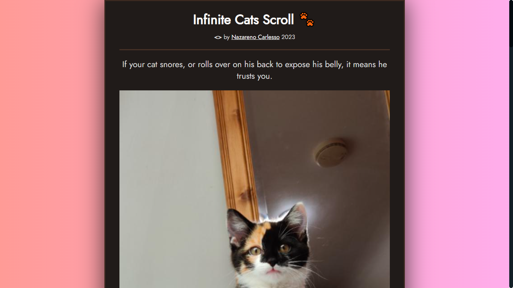
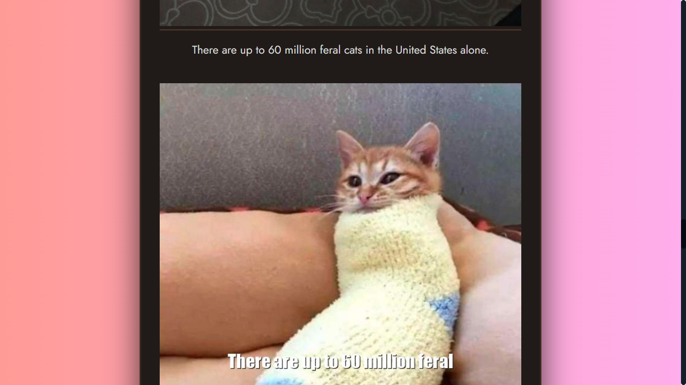

# Prueba técnica para juniors y trainees de React

#### APIs:

- Facts Random: https://catfact.ninja/fact
- Cat Random: https://cataas.com/cat

#### Instrucciones:

- Recupera un hecho aleatorio de gatos de la primera API
- Recupera la primera palabra del hecho
- Muestra una imagen de un gato con la primera palabra
- //
- Hacer un boton para refrescar la informacion
- Separar la logica de los servicios
- Realizar un custom hook para traer la imagen
- Realizar un custom hook para traer el hecho
- //
- Hacer un test end-to-end para nuestra aplicacion

## Screenshots

